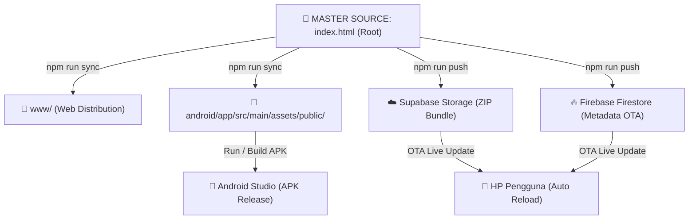

# 📱 Pendamping Amalan Digital — Android & Web App 🤲

[](https://capacitorjs.com/)
[]()
[]()
[-emerald.svg)]()
[]()

**Pendamping Amalan Digital** adalah aplikasi Islami komprehensif, modern, dan mandiri (*Offline-First*) yang dirancang khusus untuk memandu santri, jamaah, dan kaum muslimin dalam melaksanakan rangkaian amalan harian, wirid rezeki, tawasul, ibadah shalat fardhu & sunnah, serta zikir secara terstruktur, akurat, dan khusyuk.

---

## 📑 Daftar Isi
1. [🌟 Fitur & Modul Utama](#-fitur--modul-utama)
   - [1. Modul Wirid, Tawasul & Doa Rezeki (31 Slide)](#1-modul-wirid-tawasul--doa-rezeki-31-slide)
   - [2. Jadwal Shalat Hisab Kemenag RI & Pengingat Adzan](#2-jadwal-shalat-hisab-kemenag-ri--pengingat-adzan)
   - [3. Kompas Arah Kiblat 3D & Sensor Satelit Presisi](#3-kompas-arah-kiblat-3d--sensor-satelit-presisi)
   - [4. Tasbih Digital Cerdas & Multi-Target](#4-tasbih-digital-cerdas--multi-target)
   - [5. Pencarian Universal & Lompat Slide Indeks](#5-pencarian-universal--lompat-slide-indeks)
   - [6. Sistem Pembaruan Tanpa Install Ulang (OTA Server Update)](#6-sistem-pembaruan-tanpa-install-ulang-ota-server-update)
2. [🏛️ Arsitektur Proyek: Single Source of Truth](#️-arsitektur-proyek-single-source-of-truth)
3. [📂 Struktur Direktori Proyek](#-struktur-direktori-proyek)
4. [🔒 Keamanan & Variabel Lingkungan (.env)](#-keamanan--variabel-lingkungan-env)
5. [⚙️ Alur Kerja & Perintah Utama (NPM Scripts)](#️-alur-kerja--perintah-utama-npm-scripts)
6. [📱 Panduan Build & Debugging di Android Studio](#-panduan-build--debugging-di-android-studio)
7. [☁️ Cara Merilis Pembaruan OTA (Over-The-Air)](#️-cara-merilis-pembaruan-ota-over-the-air)
8. [📜 Standar Tipografi & Fiqih](#-standar-tipografi--fiqih)

---

## 🌟 Fitur & Modul Utama

### 1. Modul Wirid, Tawasul & Doa Rezeki (31 Slide)
Modul pembacaan wirid yang disusun secara berurutan (*step-by-step*) dengan tipografi Rasm Utsmani resmi Kemenag RI:
- **Slide 1 (Beranda / Pembuka)**: Kalimat suci *Bismillāhir-raḥmānir-raḥīm* dengan penataan hero center yang anggun.
- **Slide 2 (Adab & Persiapan Ibadah)**: Panduan bersuci lahir-batin, tata cara dan niat **Shalat Sunnah Taubat** (2 Rakaat) + Sayyidul Istighfar, **Shalat Sunnah Tahajud & Witir** (8+3 Rakaat) + Doa Shahih Bukhari-Muslim, serta **Shalat Sunnah Dhuha** (2–8 Rakaat) + Doa Dhuha lengkap Arab, Latin, dan Terjemahan.
- **Slide 3 s/d 6 (Muqaddimah & Perlindungan)**: Ayat Kursi, Surat Al-Ikhlas, Al-Falaq, An-Nas, Al-Fatihah, Surat Pagar Gaib (Benteng Keselamatan), Āmanar Rasūl (2 ayat terakhir Al-Baqarah), serta Shalawat Jibril & Nariyah.
- **Slide 7 s/d 17 (Silsilah Tawasul Lengkap 1–11)**:
  1. *Nabi Muhammad SAW & Ahlul Bait*
  2. *Empat Khulafaur Rasyidin (Abu Bakar, Umar, Utsman, Ali RA)*
  3. *Para Malaikat Muqarrabin (Jibril, Mikail, Israfil, Izrail AS)*
  4. *Nabi Khidir AS & Para Nabi Allah*
  5. *Sultan Auliya Syaikh Abdul Qadir Al-Jailani RA*
  6. *Para Wali Songo (Penyebar Islam Nusantara)*
  7. *Para Guru Mursyid & Masyaikh Shalihin*
  8. *Kedua Orang Tua (Birrul Walidain)*
  9. *Kaum Muslimin & Muslimat (Leluhur)*
  10. *Diri Sendiri & Hajat Pribadi*
  11. *Rijalul Ghaib & Penjaga Keberkahan*
- **Slide 18 s/d 30 (Inti Amalan & Doa Gabungan Rezeki)**: Rangkaian Istighfar, Tasbih, Tahmid, Takbir, Tahlil, Asmaul Husna (*Yā Fattāḥ Yā Razzāq*, *Yā Ghaniyyu Yā Mughnī*), Ayat Seribu Dinar, hingga Doa Khusus Rezeki Berlimpah.
- **Slide 31 (Munajat Penutup)**: Kalimat syukur penutup *Al-Ḥamdu lillāhi Rabbil-'Ālamīn*.
- **Fitur Khusus Reader**:
  - *Perataan Teks Arab*: Rata Kanan-Kiri (*Justified RTL*) pada Slide 2 s/d 30, dan Rata Tengah (*Center*) pada Slide 1 & 31.
  - *Gestur Sentuh Cerdas*: Mendukung *swipe* layar sentuh kiri/kanan dengan efek animasi halus.
  - *Auto-Advance*: Mode otomatis berpindah slide secara realtime berdasarkan timer santai.
  - *Filter Mode Baca*: Tampilkan Semua (Arab + Latin + Terjemah), Arab Saja, atau Latin & Arti Saja.
  - *Pemutar Audio Latar*: Pemutar MP3 amalan dengan kontrol mengambang (*Floating Widget*), *seekbar*, dan jeda otomatis.

---

### 2. Jadwal Shalat Hisab Kemenag RI & Pengingat Adzan
- **Kalkulasi Astronomis Presisi**: Menggunakan algoritma hisab bola trigonometri Kementerian Agama RI (Sudut Subuh -20°, Sudut Isya 18°, Koreksi Ketinggian/Elevasi, dan Koreksi Ikhtiyat +2 menit).
- **Deteksi Shalat Berikutnya**: Kartu status dinamis yang menghitung mundur jam, menit, dan detik menuju waktu shalat fardhu selanjutnya (*Next Prayer Countdown*).
- **Audio Adzan & Tarhim Resmi Offline**:
  1. *Adzan Makkah — Syaikh Ali Ahmad Mulla / Zahrani*
  2. *Adzan Madinah — Syaikh Abdul Majid Surur / Qassas*
  3. *Adzan Bayati — Ustadz Fahmi*
  4. *Adzan Kurdi — Syaikh Mishary Rashid Al-Afasy*
  5. *Adzan Khusus Subuh — Ustadz Salim Bahanan*
  6. *Tarhim Pembuka — Syaikh Mahmud Khalil Al-Hushariy*
- **Alarm Latar Belakang Native**: Terintegrasi dengan `@capacitor/local-notifications` yang tetap berdering tepat waktu meskipun aplikasi sedang ditutup atau layar HP mati terkunci.

---

### 3. Kompas Arah Kiblat 3D & Sensor Satelit Presisi
- **Perhitungan Azimuth Ka'bah (WGS84)**: Menghitung sudut derajat kiblat dari posisi koordinat pengguna langsung ke Ka'bah (Lat: `21.422487° N`, Lng: `39.826206° E`).
- **Low-Pass Filter (LPF) Smoothing**: Menghilangkan getaran sensor kompas HP (*jitter-free*) sehingga perputaran jarum 3D sangat mulus dan stabil.
- **Umpan Balik Haptik (Getar)**: Ponsel bergetar secara instan saat sudut hadap pengguna tepat mengarah ke Ka'bah (toleransi presisi ±3°).
- **Kalibrasi Angka 8 & Offset Manual**: Dilengkapi panduan kalibrasi sensor magnetometer dan pengaturan kompensasi deviasi magnetik bumi.

---

### 4. Tasbih Digital Cerdas & Multi-Target
- **Pilihan Target Wirid**: 33x, 99x, 100x, 300x, 1000x, atau Mode Bebas (*Unlimited*).
- **Respon Multi-Sensori**: Setiap ketukan memberikan getaran haptik ringan dan feedback audio klik tasbih; saat mencapai target, sistem memberikan getaran ritmis panjang.
- **Penyimpanan Riwayat Otomatis**: Menghitung akumulasi total dzikir harian yang tersimpan aman di penyimpanan lokal (*LocalStorage*).

---

### 5. Pencarian Universal & Lompat Slide Indeks
- **Pencarian Cepat (*Instant Search*)**: Mengetik kata kunci apa saja (nama nabi, nomor tawasul, lafaz Arab, potongan Latin, atau arti bahasa Indonesia) akan langsung menampilkan cuplikan teks dan memungkinkan pengguna melompat ke slide yang bersangkutan.
- **Modal Indeks Daftar Slide**: Membuka kisi (*grid*) 31 bab amalan untuk navigasi cepat.

---

### 6. Sistem Pembaruan Tanpa Install Ulang (OTA Server Update)
Aplikasi dibekali teknologi **Over-The-Air (OTA) Live Update** berbasis `@capgo/capacitor-updater`:
- **Dual-Mode Splash Screen**:
  - *Mode Normal (3.5 Detik)*: Menginisialisasi sistem hardware, menghitung hisab shalat, memvalidasi font, dan mempersiapkan data amalan dengan indikator progress bar penuh 100%.
  - *Mode Unduh Pembaruan*: Saat ada rilis bundle baru dari server, splash screen otomatis berubah menampilkan status *"MENGUNDUH PEMBARUAN"* lengkap dengan persentase unduhan berkas.
- **Keterangan Status Otomatis**: Jika aplikasi sudah versi terbaru, menekan tombol Update di headbar akan memunculkan notifikasi elegan *"✓ Aplikasi sudah versi terbaru (v1088)"*.
- **Tanpa Unduh Ulang APK**: Seluruh perbaikan teks, fitur doa, dan tampilan akan langsung diperbarui ke HP pengguna dalam hitungan detik.

---

## 🏛️ Arsitektur Proyek: Single Source of Truth

Untuk menjaga konsistensi antara pengembangan Web, AI Assistant, dan **Android Studio**, proyek ini menganut arsitektur **Single Source of Truth (Sistem Tunggal)**:



1. **`index.html` (Master Source File)**:
   Segala modifikasi HTML, CSS, JavaScript, dan konten amalan dilakukan **hanya pada satu file ini**.
2. **`npm run sync`**:
   Skrip otomatisasi menyalin seluruh perubahan dari root ke folder `www/` dan folder aset Android Studio, lalu menjalankan `npx cap sync android`.
3. **Android Studio**:
   Cukup buka folder `android/` di Android Studio dan lakukan **Run (▶)** tanpa perlu mengutak-atik kode internal WebView secara manual.

---

## 📂 Struktur Direktori Proyek

```
Pendamping_Amalan_Digital/
├── index.html                   # 🌟 MASTER SOURCE FILE (Pusat Seluruh Kode & Fitur)
├── .env                         # 🔒 Kredensial Rahasia & API Key (Terlindungi di .gitignore)
├── .env.example                 # 📋 Template Konfigurasi Environment Variables
├── .gitignore                   # 🛡️ Daftar Berkas Rahasia & Build Cache yang Diabaikan Git
├── README.md                    # 📖 Dokumentasi Lengkap Proyek
├── package.json                 # 📦 Konfigurasi Proyek & NPM Script Commands
├── capacitor.config.json        # ⚙️ Konfigurasi Capacitor Android (App ID: com.prabu26.pendampingamalan)
├── assets/                      # 🎨 Berkas Media, Audio, & Font Resmi
│   ├── images/                  # Aset Visual & Ikon
│   │   ├── Logo_Pesantren.png   # Logo Brand Resmi Pesantren
│   │   └── islamic_dome_bg.jpg  # Background Header Kubah Masjid
│   ├── audio/                   # Berkas MP3 Adzan & Tarhim
│   │   ├── adzan_bayati_fahmi.mp3
│   │   ├── adzan_kurdi_mishary.mp3
│   │   ├── adzan_madinah_qassas.mp3
│   │   ├── adzan_mekkah_zahrani.mp3
│   │   ├── adzan_subuh_bahanan.mp3
│   │   ├── adzan_subuh_kurdi_mishary.mp3
│   │   └── tarhim_hushariy.mp3
│   └── fonts/                   # Tipografi Standar Kemenag RI
│       └── LPMQ-IsepMisbah.ttf  # Font Resmi Mushaf Standar Indonesia
├── scripts/                     # ⚡ Skrip Otomatisasi & Deployment
│   ├── sync_android.js          # Skrip Sinkronisasi Master Root -> www & Android
│   └── push_ota.js              # Skrip Rilis OTA (Supabase Storage + Firebase Firestore)
├── www/                         # 🌐 Folder Distribusi Web (Auto-Generated via sync)
└── android/                     # 🤖 Project Native Android Studio (Java / Gradle)
    ├── app/
    │   ├── build.gradle         # Gradle Configuration (SDK 35, Min SDK 24)
    │   └── src/main/
    │       ├── AndroidManifest.xml
    │       └── assets/public/   # Aset Web yang Dikompilasi ke APK
    └── build.gradle
```

---

## 🔒 Keamanan & Variabel Lingkungan (.env)

Seluruh kunci rahasia (*secret API keys*) untuk autentikasi Supabase dan Firebase Firestore tersimpan aman di file `.env` pada folder root dan **tidak pernah dimasukkan ke dalam file client `index.html`**:

```ini
# ==========================================
# 🔒 SUPABASE STORAGE (OTA ZIP BUCKET)
# ==========================================
SUPABASE_URL=https://your-project.supabase.co
SUPABASE_SERVICE_ROLE_KEY=your-supabase-service-role-secret-key
SUPABASE_BUCKET_NAME=ota-updates

# ==========================================
# 🔥 FIREBASE FIRESTORE (METADATA OTA)
# ==========================================
FIREBASE_PROJECT_ID=pendamping-amalan
FIREBASE_API_KEY=AIzaSy...
FIREBASE_AUTH_DOMAIN=pendamping-amalan.firebaseapp.com
```

> [!IMPORTANT]
> - Berkas `.env` telah didaftarkan dalam `.gitignore` sehingga tidak akan pernah terunggah ke repositori GitHub publik.
> - Client web `index.html` hanya membaca dokumen Firestore publik melalui REST API tanpa hak akses tulis (*read-only*), menjamin keamanan data dari serangan pihak luar.

---

## ⚙️ Alur Kerja & Perintah Utama (NPM Scripts)

Buka terminal di folder proyek dan gunakan perintah berikut:

| Perintah | Deskripsi & Kegunaan |
| :--- | :--- |
| **`npm run sync`** | **Sinkronisasi Sistem Tunggal**: Menyalin seluruh perubahan `index.html` dan aset ke `www/` serta `android/`, lalu menjalankan `npx cap sync android`. |
| **`npm run push`** | **Rilis OTA Server**: Otomatis menaikkan versi build, mengompres bundle ZIP, mengunggah ke Supabase Storage, memperbarui dokumen Firestore, dan menyinkronkan aset Android. |
| **`npm start`** | **Pratinjau Browser**: Menjalankan web server lokal untuk menguji tampilan aplikasi di browser. |

---

## 📱 Panduan Build & Debugging di Android Studio

1. **Jalankan Sinkronisasi**:
   ```bash
   npm run sync
   ```
2. **Buka Android Studio**:
   - Pilih menu **Open an Existing Project** dan arahkan ke folder `Pendamping_Amalan_Digital/android`.
3. **Sinkronisasi Gradle**:
   - Tunggu Gradle selesai mengunduh dependensi (`@capacitor/core`, `@capacitor/geolocation`, `@capacitor/local-notifications`, `@capgo/capacitor-updater`, dll).
4. **Jalankan Aplikasi**:
   - Sambungkan HP Android via kabel USB (aktifkan *USB Debugging*) atau pilih Emulator Android.
   - Klik tombol **Run (▶)** di Android Studio.
5. **Membuat File APK Siap Rilis**:
   - Di Android Studio, pilih menu: **Build** > **Generate Signed Bundle / APK...** > **APK** > Masukkan Keystore > Pilih **Release**.

---

## ☁️ Cara Merilis Pembaruan OTA (Over-The-Air)

Jika Anda ingin memperbarui teks doa, mengubah fitur, atau memperbaiki bug **tanpa meminta pengguna menginstal ulang APK**:

1. Lakukan pengeditan pada master file `index.html`.
2. Jalankan perintah:
   ```bash
   npm run push
   ```
3. Skrip akan secara otomatis:
   - Membuat file arsip ZIP (`bundle-vXXXX.zip`).
   - Mengunggah ZIP ke Supabase Storage.
   - Memperbarui nomor versi di Firebase Firestore (`app_updates/latest`).
4. Saat pengguna membuka aplikasi di HP mereka dan menekan tombol **🔄 Update**, aplikasi akan langsung mendownload bundle baru dan me-reload tampilan secara instan.

---

## 📜 Standar Tipografi & Fiqih

- **Khat Arab**: Menggunakan font resmi **LPMQ Isep Misbah** (Lembaga Pentashihan Mushaf Al-Qur'an Kementerian Agama Republik Indonesia) berstandar Rasm Utsmani dengan harakat lengkap yang jelas terbaca di berbagai ukuran layar.
- **Keshahihan Doa**: Seluruh lafaz doa pada Modul Adab & Wirid bersumber dari kitab-kitab hadits mu'tabarah (Shahih Bukhari, Shahih Muslim, Sunan Abi Dawud, At-Tirmidzi) dan amalan para ulama shalihin.
- **Hisab Waktu Shalat**: Mengikuti pedoman hisab syar'i Kemenag RI dengan pengaman waktu (*Ihtiyāṭ*) sebesar 2 menit untuk menjamin keabsahan awal masuk waktu shalat.

---

<p align="center">
  <b>© 2026 Pendamping Amalan Digital</b><br>
  <i>Didedikasikan untuk Kemaslahatan Ummat & Kemudahan Beribadah</i>
</p>
